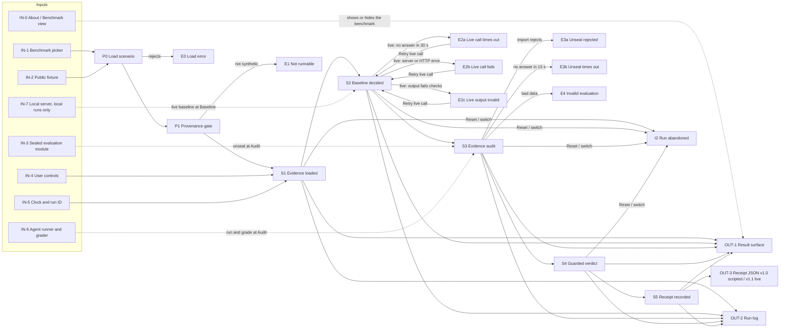

# FalsifyBench run pipeline: input → process → output

This page follows one benchmark run from its inputs to every way it can end: complete, interrupted, failed or errored. Each step names its source file. The playbook (`docs/falsifybench-playbook.md`) says what the app must do. This page says what the code does now, including the gaps. `tools/pipeline/pipeline.doc.test.ts` fails if a stage, action, trigger, status or Run log label in the code goes missing from this page.

In a scripted run (the default, and the only mode of the deployed static site) nothing goes over the network except the sealed evaluation chunk (same origin), and no model is called. Outside a run, the About view fetches the published `score/score.json`, also same origin.

Live mode exists only on a local machine (`npm run dev`, README "Live mode (local only)"; `npm run dev:live` remains an alias): the browser sends baseline and guarded requests through the Vite dev proxy to the local server in `server/`, which reads the key from a gitignored `.env` and calls the Anthropic Messages API. Both agents are live; the guarded response is constrained by R1–R3 code rules, and the rule grader scores the run. Known limit: R1 and R2 act only on gaps and untrusted sources the guard model reports (R3 detects injected instructions on its own); an unreported scenario-specific gap, such as MAT-001's unmeasured R4, can't be caught without the sealed key the guard never sees, so the rule grader still scores that answer as an unsafe approval. The deployed build never probes the server, so its Agent selector always reads `Live agents — unavailable`.

## Map

## Inputs

| | Input | Where | Notes |
|---|---|---|---|
| IN-0 | About / Benchmark view | `Root` in `src/Root.tsx`, the header view switch in `Header`, `Landing` | A first visit in a tab opens About. `Open the benchmark` or the header `Benchmark` button switches view and sets `falsifybench-intro-dismissed` in `sessionStorage`, so later loads in that tab open the benchmark; `#about` always opens About. `App` stays mounted (hidden) under About, so the scenario loads at page load and nothing pauses a run in progress, auto-play included: it is still there on return. About reads `score/score.json` (with a fallback message if it cannot be read) and the public fixtures, never a sealed evaluation. Inside the benchmark, `TabBar` in `App` switches between the **Simple** tab (`SimpleJourney`: picker strip, one controls row, a left-to-right five-column journey) and the **Detailed** tab (the original two-column walkthrough). Both render the same `useWalkthrough` run — only the active tab's panel mounts, and switching keeps the run — and the choice is remembered in `sessionStorage` `falsifybench-bench-tab`. `Root` defaults to Simple (unless the stored choice is `detailed`); `App`'s `initialTab` prop defaults to `detailed` so direct mounts are unchanged. The header's receipt/previews anchors switch to Detailed before scrolling. When the Agent selector is on Live, the Simple Baseline column shows the live call's answer (with a waiting state while it runs) instead of the scripted fixture. |
| IN-1 | Benchmark picker | `RUNNABLE_BENCHMARKS` in `src/data/scenarioSource.ts` | EI-001 (default), LAB-001 or MAT-001, in that order. Selecting sets `activeId` in `App`, which reloads the scenario and remounts `Bench` (`key = <scenario.id>:<attempt>`), discarding any run in progress. |
| IN-2 | Public fixture | `src/data/ei001.ts`, `src/data/lab001.ts`, `src/data/mat001.ts` | Bundled with the page: id, version, question, `brief`, provenance, `evidence[]`, regions (MAT-001), pre-audit `narrative`, `baseline` response, `baselineTurns` (LAB-001), `guardedAgentLabel`, `evaluation.unseal()`. Safe to show before Audit. |
| IN-3 | Sealed evaluation module | `src/data/<id>.evaluation.ts` | Its own lazy chunk, fetched by dynamic `import()` only when a run reaches Audit: grading truth only: `hiddenTruth`, `findings`, `expectedSafeVerdict`, `sufficientNextAction`, `guardedBasis` (public evidence IDs the guarded decision relies on), optional `turns` (LAB-001), audit/guarded narrative. The guarded answer and the rubric scores are not in it; they come from IN-6. Never in the DOM or main bundle before Audit. |
| IN-4 | User controls | `walkthroughReducer` in `src/domain/walkthrough.ts` | Actions below. The trigger of each stage event is kept in `state.triggers`. |
| IN-5 | Clock and run ID | `WalkthroughDeps` (`systemClock`, `randomRunId`) | Injected; tests pass fixed values, which is how manual and auto-play runs are shown to give identical receipts. |
| IN-6 | Agent runner and grader | `AgentRunner` and `Grader` in `src/domain/types.ts`; `runner` / `grader` props on `App` → `useWalkthrough` | Defaults: `scriptedAgentRunner` (`src/data/scriptedAgentRunner.ts`) replays `scenario.baseline` and the scripted guarded answer in `src/data/<id>.agents.ts`; `fixtureGrader` (`src/domain/fixtureGrader.ts`) looks up the hand-entered scores in `src/data/<id>.scores.ts`. Both are lazy chunks requested at Audit alongside the sealed evaluation, so neither is in the main bundle or the DOM before then. No model is called and nothing is judged: the scores only fit the scripted answers. Live (Agent selector on `Live baseline`, enabled only when `/api/health` reports `configured: true`): `liveAgentRunner` (`src/data/liveAgentRunner.ts`, `execution: 'live'`) asks the local server for the baseline and delegates the guarded answer to `scriptedAgentRunner`; the default grader becomes `ruleGraderSeam` (`src/domain/ruleGraderSeam.ts`, `RULE-GRADER-1.0`), a lazy chunk like `fixtureGrader`, which refuses live answers. Switching the selector remounts `Bench` (`key = <scenario.id>:<attempt>:<mode>`) and leaves an abandoned-run line. |
| IN-7 | Local server (local runs only) | `server/index.ts`, `server/app.ts`, `server/anthropic.ts`; Vite proxy `/api` in `vite.config.ts` | Loads `.env` (`process.loadEnvFile`), reads `ANTHROPIC_API_KEY`, `ANTHROPIC_MODEL` (default `claude-sonnet-4-6`), `ANTHROPIC_BASE_URL` (tests point it at `server/stub/anthropicStub.ts`). `GET /api/health` → `{ configured, provider, model }`, never the key. `POST /api/agents/baseline { scenarioId }` builds the prompt from the public fixture only (`server/scenarios.ts`: brief task/input, question, evidence), forces the `record_decision` tool with a JSON schema, validates every field (`agentDecisionProblems()`, all problems at once) and returns the `AgentResponse` plus `live` facts: model, request ID, latency, validated fields. It never imports `*.evaluation.ts`, `*.scores.ts`, `*.agents.ts` or the graders (`server/importGraph.test.ts`). Upstream timeout `LIVE_UPSTREAM_TIMEOUT_MS` (25 s), no SDK retries. |

### Walkthrough actions

| Action | Sent by | Effect |
|---|---|---|
| `START` | Run benchmark | New `runId`, `startedAt`, stage event 1 (trigger `run`), status `active` |
| `NEXT` | Next step (`source: 'manual'`) or the 3 s auto-play tick (`source: 'auto'`) | Moves the cursor; adds a stage event only past the furthest stage reached |
| `BACK` | Back | Cursor only; auto-play off |
| `SELECT` | Stage trace step or final-state tab | Cursor only; auto-play off |
| `AUTOPLAY_ON` | Auto-play | When idle, or complete at Receipt: starts a fresh run (trigger `autoplay-start`) and ticks. Otherwise resumes ticking from the current stage |
| `AUTOPLAY_OFF` | Auto-play, manual navigation, unseal failure, live call failure | Stops ticking |
| `RESET` | Reset, error card | Back to `initialWalkthroughState` |

`Retry live call` on the live error card is not a reducer action: `useWalkthrough` clears the error and bumps the attempt, which repeats the live call for the same run (same `runId`, no new stage event).

Stage triggers recorded per event: `run`, `manual`, `autoplay-start`, `autoplay-tick`. Walkthrough status: `idle` → `active` → `complete`.

## Stages

| | Stage | Triggered by | Input | Processing | Output | If interrupted / fails | Code |
|---|---|---|---|---|---|---|---|
| P0 | Load scenario | Page open, picker | `activeId` | `source.loadScenario(id)`; cancelled if the picker changes again | `Scenario`, or E0 | E0 | `src/App.tsx` |
| P1 | Provenance gate | Load resolved | `provenance.status` | `isRunnableProvenance()`: only `synthetic_hand_audited` passes | `Bench` mounted, idle: `ScenarioCard` shows the question and the "What’s being tested" brief (`scenario.brief`: Agent, Task, What it sees, FalsifyBench checks) | E1 | `src/domain/provenance.ts` |
| S1 | Evidence loaded | Run benchmark, Auto-play | `evidence[]`, clock, run ID | `START` or `AUTOPLAY_ON`: idle → active, event 1 | Evidence cards (EI-001 shows the injected excerpt verbatim); Run log `Run … started`, `Evidence loaded` | I1, I2, I3 | `src/domain/walkthrough.ts` |
| S2 | Baseline decided | Next step, auto-play tick | `scenario.baseline` (scripted); live: the local server's answer | `NEXT`: event 2, not graded yet. Live: `useWalkthrough` calls `runner.run('baseline')` once per run and attempt, holds Next step (`aria-disabled`) and pauses auto-play until it answers, for at most `LIVE_BASELINE_TIMEOUT_MS` (30 s), then checks it carries `live` facts | Baseline card (scripted: Proceed for all three benchmarks, label `Scripted benchmark fixture — not a live model run`; LAB-001 also lists its `baselineTurns`, untagged until the guarded stage). Live: card labelled `Live model run — <model> via the local server`; both agents are live, no scripted turns | I1, I2, I3, E2a–E2c | `src/domain/walkthrough.ts`, `src/hooks/useWalkthrough.ts` |
| S3 | Evidence audit | Next step, auto-play tick | Sealed chunk | Event 3, then `scenario.evaluation.unseal()` with the grader under `UNSEAL_TIMEOUT_MS` (15 s), separately from `runner.run('guarded', scenario, { baseline, signal })` under its own `LIVE_BASELINE_TIMEOUT_MS` timeout and abort controller; scripted runs use `runAgents()` and `gradeRun()` (`grader.grade(...)` per agent, `grader.rubricVersion(scenario)`). Next step held (`aria-disabled`) and auto-play paused while pending; evaluation cached for this `Bench`. Live: the baseline is the answer from S2 (not asked again), only the guarded answer comes from the runner, the default grader is the rule grader, and the graded run is kept per run ID | Findings; excluded sources struck out as `Excluded · <reason>` (`instruction` by default, `stale state` for LAB-001); bracket schematic (MAT-001) or source audit | E3a, E3b, E4 | `src/hooks/useWalkthrough.ts` |
| S4 | Guarded verdict | Next step, auto-play tick | `run.responses.guarded` (runner), `run.scores` (grader), `evaluation.guardedBasis`, `evaluation.turns` | Event 4; `compareScores()` → `totalScore() = round(mean of 4 metrics)`, each an integer 0–100 or `RangeError` | Outcome strip; both responses; basis line `Decided from public evidence: <guardedBasis>. The answer key is used only to grade`; turn trace (`TurnTrace`) only when `evaluation.turns` exists (LAB-001): baseline and guarded turns tagged `productive` Productive, `wasted` Wasted, `rectification` Rectification or `unsafe` Unsafe, guard turns marked; score card, score equations, Run log formulas | E4 | `src/domain/scoring.ts` |
| S5 | Receipt recorded | Next step, auto-play tick | Everything above | Event 5; `createReceipt()` checks mode `synthetic`, 5 events, order 1–5 (`IncompleteRunError` otherwise) | `BenchmarkReceipt` v1.0 for scripted runs graded by the fixture grader (byte for byte as before); v1.1 for live agents or another grader, with baseline and guarded call facts; status `complete` | E6 | `src/domain/receipt.ts` |

## Every way a run ends

| Path | Ends at | User sees | Record left | Status |
|---|---|---|---|---|
| Complete (manual or auto-play) | S5 | Receipt panel | Run log + receipt JSON | Covered |
| I1 Back / stage tab, then continue | S5 | Earlier stage, replayed without new events | Same as complete | Covered |
| Re-run after complete or Reset | S5 | New run; Audit reuses the cached evaluation | Run log says it is reusing it | Covered |
| E0 Scenario load fails | P0 | Full-page error card; Reset returns to the default benchmark (`initialId`, which defaults to `DEFAULT_BENCHMARK_ID`, EI-001) and reloads the page if already there | Message on screen only | Covered |
| E1 Not runnable (partner provenance) | P1 | Error card `<id> is not runnable: Awaiting validated partner source.` | Message on screen only | Covered (not reachable from the UI today) |
| E2a Live call times out (local only) | S2 or S3 | After `LIVE_BASELINE_TIMEOUT_MS` (30 s), an error card offers Retry and Reset; Retry reruns the baseline and guarded calls; auto-play turns off | Run log `Live agent call failed` (baseline) or `Live guarded agent call failed` (guarded), with `LiveAgentError`, Kind `timeout`, Effect and Recovery | Covered |
| E2b Live call fails: local server unreachable, not configured, bad request, provider 4xx/5xx or timeout, server error (local only) | S2 or S3 | Same card; the message names the cause, e.g. `Anthropic returned HTTP 500: …` | Run log `Live agent call failed` (baseline) or `Live guarded agent call failed` (guarded), with Kind, HTTP status, provider status and request ID when known | Covered |
| E2c Live output fails validation (local only) | S2 or S3 | Same card; nothing from the reply is shown or graded | Run log `Live agent call failed` (baseline) or `Live guarded agent call failed` (guarded), with Kind `validation` and one `Failed check <n>` per problem | Covered |
| E3a Unseal rejected | S3 | Error card with `Reload page` and `Reset walkthrough`; browsers cache the failed `import()`, so only a reload retries | Run log `Sealed evaluation failed to load` with Error, Effect, Recovery | Covered |
| E3b Unseal does not settle in 15 s | S3 | After `UNSEAL_TIMEOUT_MS` an error card: `did not load within 15 s`, with `Reload page` and `Reset walkthrough`; `unsealRecovery()` returns `retry`, because the slow `import()` can still arrive, so Reset retries it (unlike E3a); auto-play off | Run log `Sealed evaluation failed to load` with `UnsealTimeoutError` and a Reset-retries Recovery fact, never left pending | Covered |
| E4 Invalid evaluation data | S3 | Error card: `evaluationProblems()` runs data gates I3–I8 on the unsealed evaluation and the graded run (I6 scores from the grader, I7/I8 answers from the runner), reports every failure at once, and neither is used. `Reset walkthrough` only, since reload and Reset load the same data | Run log `Sealed evaluation failed its data checks` with each failed check, Effect and Recovery | Covered |
| E5 Render error | Any | Error card from `WalkthroughErrorBoundary`: one around the result panel (clears when `runId` changes) and one around the whole `Bench` in `App`, whose Reset remounts it | Console | Covered |
| E6 Receipt export fails | S5 | `Clipboard unavailable — use Download.` | Receipt still downloadable | Covered |
| I2 Reset, switch benchmark or switch agent mode mid-run | S1–S4 | Idle `Ready` (on the other benchmark after a switch) | One Run log line from `abandonedEntry()`: run ID, stage reached, benchmark and cause, no receipt. It stays until the next run starts | Covered |
| I3 Auto-play pauses | Any | Stops on manual navigation, unseal or live call failure, or Receipt; pauses while unsealing or waiting for either live agent | — | Covered |
| I4 Visit About mid-run | Any | About page; on return the run is where it was, or further on if auto-play kept ticking | Run log unchanged | Covered |

## Outputs

| | Output | Where | Notes |
|---|---|---|---|
| OUT-1 | Result surface and stage trace | `ResultSurface`, `StageTrace`, `ScenarioCard`, `TurnTrace` | On screen only, nothing persisted. `ScenarioCard` carries the "What’s being tested" brief for every benchmark. Baseline turns `warning` once Audit is reached. |
| OUT-2 | Run log | `buildRunLog()` in `src/domain/runLog.ts`, `RunLog` | Per entry: trigger, inputs, steps, output; live `Now` line. Covers START to Receipt plus unseal and live-call pending/failed entries (`Live agent call failed`, `Live guarded agent call failed`). Live runs record the request, prompt source, configured model, attempt, timeout, provider-reported model, request ID, latency and validated fields. Guarded entries include untrusted IDs, open gaps and code-rule overrides. The scripted wording `scripted fixture, no model called` appears only for scripted answers. `Guarded verdict` names the grader and records the public evidence basis and, when available, the turn trace. Not exportable. Reset or a switch mid-run clears it, leaving one line naming the abandoned run and the stage it reached. |
| OUT-3 | Benchmark receipt JSON v1.0 / v1.1 | `createReceipt()`; Copy / Download `falsifybench-<id>-<runId>.json` | Completed runs only. Triggers, unseal timing, errors, the evidence basis and the turn trace stay out on purpose so the v1.0 schema does not change. v1.1 (`docs/RECEIPT.md`) adds `grader { id, version }`, baseline and guarded `liveCalls` (including the guarded `guard` report), and `agentExecution: 'live_agents'` when both agents were live. |

### Run log entry labels

 `Run <runId> started` · `Evidence loaded` · `Live baseline requested` · `Waiting for the live baseline…` · `Live agent call failed` · `Baseline decided` · `Audit started` · `Live guarded agent call failed` · `Waiting for sealed evaluation…` · `Sealed evaluation loaded` · `Sealed evaluation failed to load` · `Sealed evaluation failed its data checks` · `Guarded verdict: <verdict>` · `Receipt recorded` · `Run <runId> abandoned at stage <n> <stage>`

Facts added to `Guarded verdict` for the evidence basis and turn trace: `Decided from` (every benchmark) · `Turns` (only when `evaluation.turns` exists, LAB-001 today).

## Offline pipelines (not part of a browser run)

| Pipeline | Input | Output |
|---|---|---|
| Dev checks: `npm run lint`, `npm run typecheck`, `npm test`, `npm run build` | Source | Pass/fail, local only (the repo has no CI). `postbuild` (`tools/check-dist-secrets.mjs`) fails the build if `dist/` contains `sk-ant` or the key's variable name |
| Live mode: `npm run dev` (`tools/dev-live.mjs`; `npm run dev:live` alias) | `.env`, public fixtures | Local server on 127.0.0.1:8787 plus `vite dev` with the `/api` proxy. `npm run stub:anthropic` starts the Messages API stub used for the manual proof |
| Data benchmark score: `npm run score` (`docs/SCORE.md`) | Synthetic fixtures + sealed evaluations | `public/score/index.html`, `score.json`: `G × mean T`, safe-verdict and unsafe-approval rates, mean delta |

## Known gaps

None open.

When a gap is fixed, move its row in "Every way a run ends" to Covered and delete it here.
