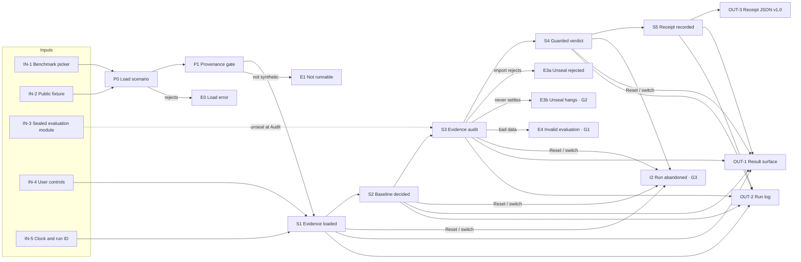

# FalsifyBench run pipeline: input → process → output

This page follows one benchmark run from its inputs to every way it can end: complete, interrupted, failed or errored. Each step names its source file. The playbook (`docs/falsifybench-playbook.md`) says what the app must do. This page says what the code does now, including the gaps. `tools/pipeline/pipeline.doc.test.ts` fails if a stage, action, trigger, status or Run log label in the code goes missing from this page.

Nothing in a run goes over the network except the sealed evaluation chunk (same origin), and no model is called.

## Map

## Inputs

| | Input | Where | Notes |
|---|---|---|---|
| IN-1 | Benchmark picker | `RUNNABLE_BENCHMARKS` in `src/data/scenarioSource.ts` | MAT-001 (default) or EI-001. Selecting sets `activeId` in `App`, which reloads the scenario and remounts `Bench` (`key = scenario.id`), discarding any run in progress. |
| IN-2 | Public fixture | `src/data/mat001.ts`, `src/data/ei001.ts` | Bundled with the page: id, version, question, provenance, `evidence[]`, regions, pre-audit `narrative`, `baseline` response, `guardedAgentLabel`, `evaluation.unseal()`. Safe to show before Audit. |
| IN-3 | Sealed evaluation module | `src/data/<id>.evaluation.ts` | Its own lazy chunk, fetched by dynamic `import()` only when a run reaches Audit: `hiddenTruth`, `findings`, `expectedSafeVerdict`, `guarded` response, `scoring`, audit/guarded narrative. Never in the DOM or main bundle before Audit. |
| IN-4 | User controls | `walkthroughReducer` in `src/domain/walkthrough.ts` | Actions below. The trigger of each stage event is kept in `state.triggers`. |
| IN-5 | Clock and run ID | `WalkthroughDeps` (`systemClock`, `randomRunId`) | Injected; tests pass fixed values, which is how manual and auto-play runs are shown to give identical receipts. |

### Walkthrough actions

| Action | Sent by | Effect |
|---|---|---|
| `START` | Run benchmark | New `runId`, `startedAt`, stage event 1 (trigger `run`), status `active` |
| `NEXT` | Next step (`source: 'manual'`) or the 3 s auto-play tick (`source: 'auto'`) | Moves the cursor; adds a stage event only past the furthest stage reached |
| `BACK` | Back | Cursor only; auto-play off |
| `SELECT` | Stage trace step or final-state tab | Cursor only; auto-play off |
| `AUTOPLAY_ON` | Auto-play | When idle, or complete at Receipt: starts a fresh run (trigger `autoplay-start`) and ticks. Otherwise resumes ticking from the current stage |
| `AUTOPLAY_OFF` | Auto-play, manual navigation, unseal failure | Stops ticking |
| `RESET` | Reset, error card | Back to `initialWalkthroughState` |

Stage triggers recorded per event: `run`, `manual`, `autoplay-start`, `autoplay-tick`. Walkthrough status: `idle` → `active` → `complete`.

## Stages

| | Stage | Triggered by | Input | Processing | Output | If interrupted / fails | Code |
|---|---|---|---|---|---|---|---|
| P0 | Load scenario | Page open, picker | `activeId` | `source.loadScenario(id)`; cancelled if the picker changes again | `Scenario`, or E0 | E0 | `src/App.tsx` |
| P1 | Provenance gate | Load resolved | `provenance.status` | `isRunnableProvenance()`: only `synthetic_hand_audited` passes | `Bench` mounted, idle | E1 | `src/domain/provenance.ts` |
| S1 | Evidence loaded | Run benchmark, Auto-play | `evidence[]`, clock, run ID | `START` or `AUTOPLAY_ON`: idle → active, event 1 | Evidence cards (EI-001 shows the injected excerpt verbatim); Run log `Run … started`, `Evidence loaded` | I1, I2, I3 | `src/domain/walkthrough.ts` |
| S2 | Baseline decided | Next step, auto-play tick | `scenario.baseline` (scripted) | `NEXT`: event 2, not graded yet | Baseline card (Proceed for both benchmarks) | I1, I2, I3 | `src/domain/walkthrough.ts` |
| S3 | Evidence audit | Next step, auto-play tick | Sealed chunk | Event 3, then `scenario.evaluation.unseal()`; Next step held (`aria-disabled`) and auto-play paused while pending; result cached for this `Bench` so a re-run after Reset makes no new request | Findings, excluded sources struck out, schematic or source audit | E3a, E3b, E4 | `src/hooks/useWalkthrough.ts` |
| S4 | Guarded verdict | Next step, auto-play tick | `evaluation.guarded`, `evaluation.scoring` | Event 4; `compareScores()` → `totalScore() = round(mean of 4 metrics)`, each an integer 0–100 or `RangeError` | Outcome strip, score card, score equations, Run log formulas | E4 | `src/domain/scoring.ts` |
| S5 | Receipt recorded | Next step, auto-play tick | Everything above | Event 5; `createReceipt()` checks mode `synthetic`, 5 events, order 1–5 (`IncompleteRunError` otherwise) | `BenchmarkReceipt` v1.0; status `complete` | E6 | `src/domain/receipt.ts` |

## Every way a run ends

| Path | Ends at | User sees | Record left | Status |
|---|---|---|---|---|
| Complete (manual or auto-play) | S5 | Receipt panel | Run log + receipt JSON | Covered |
| I1 Back / stage tab, then continue | S5 | Earlier stage, replayed without new events | Same as complete | Covered |
| Re-run after complete or Reset | S5 | New run; Audit reuses the cached evaluation | Run log says it is reusing it | Covered |
| E0 Scenario load fails | P0 | Full-page error card; Reset returns to MAT-001 (reloads if already there) | Message on screen only | Covered |
| E1 Not runnable (partner provenance) | P1 | Error card `<id> is not runnable: Awaiting validated partner source.` | Message on screen only | Covered (not reachable from the UI today) |
| E3a Unseal rejected | S3 | Error card with `Reload page` and `Reset walkthrough`; browsers cache the failed `import()`, so only a reload retries | Run log `Sealed evaluation failed to load` with Error, Effect, Recovery | Covered |
| E3b Unseal never settles | S3 | `Waiting for sealed evaluation…` with no end | Pending Run log line | **Gap G2** |
| E4 Invalid evaluation data | S3–S5 | Blank page: `buildRunLog()` / `createReceipt()` throw while `Bench` renders, outside `WalkthroughErrorBoundary` | Nothing (console only) | **Gap G1** |
| E5 Render error in the result panel | Any | Error card from `WalkthroughErrorBoundary`; clears when `runId` changes | Console | Covered |
| E6 Receipt export fails | S5 | `Clipboard unavailable — use Download.` | Receipt still downloadable | Covered |
| I2 Reset or switch benchmark mid-run | S1–S4 | Idle `Ready` | Nothing; Reset clears the log and a switch remounts `Bench` | **Gap G3** |
| I3 Auto-play pauses | Any | Stops on manual navigation, unseal failure or Receipt; pauses while unsealing | — | Covered |

## Outputs

| | Output | Where | Notes |
|---|---|---|---|
| OUT-1 | Result surface and stage trace | `ResultSurface`, `StageTrace`, `ScenarioCard` | On screen only, nothing persisted. Baseline turns `warning` once Audit is reached. |
| OUT-2 | Run log | `buildRunLog()` in `src/domain/runLog.ts`, `RunLog` | Per entry: trigger, inputs, steps, output; live `Now` line. Covers START to Receipt plus the unseal pending/failed entries. Not exportable; lost on Reset or a switch. |
| OUT-3 | Benchmark receipt JSON v1.0 | `createReceipt()`; Copy / Download `falsifybench-<id>-<runId>.json` | Completed runs only. Triggers, unseal timing and errors stay out on purpose so the v1.0 schema does not change. |

### Run log entry labels

`Run <runId> started` · `Evidence loaded` · `Baseline decided` · `Audit started` · `Waiting for sealed evaluation…` · `Sealed evaluation loaded` · `Sealed evaluation failed to load` · `Guarded verdict: <verdict>` · `Receipt recorded`

## Offline pipelines (not part of a browser run)

| Pipeline | Input | Output |
|---|---|---|
| Dev checks: `npm run lint`, `npm run typecheck`, `npm test`, `npm run build` | Source | Pass/fail, local only (the repo has no CI) |
| Data benchmark score: `npm run score` (`docs/SCORE.md`) | Synthetic fixtures + sealed evaluations | `public/score/index.html`, `score.json`: `G × mean T`, safe-verdict and unsafe-approval rates, mean delta |

## Known gaps

| | Gap | Plan |
|---|---|---|
| G1 | Invalid evaluation data blanks the page | Validate the unsealed evaluation before storing it, so bad data takes the E3a error path |
| G2 | Unseal has no timeout | Reject after 15 s with an error card and Run log entry |
| G3 | Abandoned runs leave no trace | Keep a one-line `abandoned at <stage>` Run log entry |

When a gap is fixed, move its row in "Every way a run ends" to Covered and delete it here.
